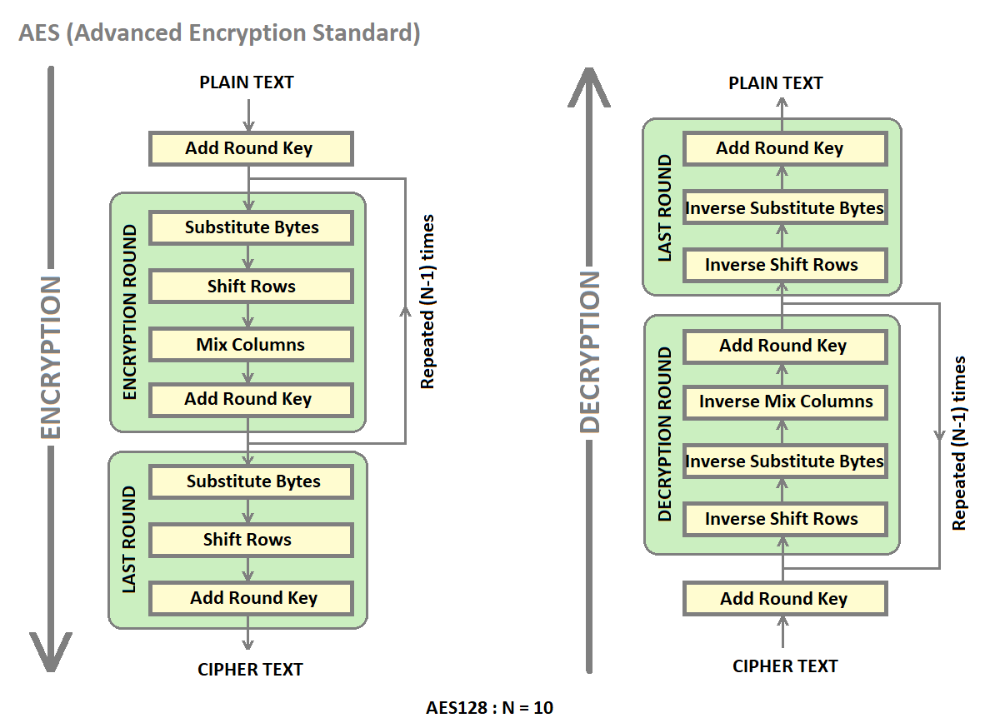

# 🔐 AES-128 Encryption & Decryption Core  

## 📌 Project Overview  
This project implements a complete **AES-128 (Advanced Encryption Standard)** encryption and decryption core in **Verilog HDL**.  
Suggested and guided by **Dr. Ashwini Kumar Malviya**, this project was a **hands-on exploration of hardware-accelerated cryptography**, bridging **VLSI design principles** with **practical cybersecurity applications**.  

The design was **verified through rigorous simulation** and **successfully implemented on the Basys3 FPGA board**, demonstrating real-world feasibility.  

---

## ✨ Project Highlights  
- 🔄 **Dual Functionality** – Complete AES-128 solution with both **encryption** and **decryption** modules.  
- ⚡ **High-Performance Combinational Design** – Fully unrolled architecture that processes an entire **128-bit block in a single clock cycle**.  
- 🖥️ **FPGA Implementation** – Synthesized and deployed on **Basys3 FPGA**, validating hardware prototype feasibility.  
- 📊 **Standards Compliance** – Verified against **NIST FIPS PUB 197 official test vectors**.  
- ⚖️ **Trade-off Analysis** – Compared **combinational (high speed)** vs. **sequential (low area)** design approaches.  

---

## 🧠 Architecture & Methodology  

AES-128 uses **10 rounds** of transformations for a 128-bit key.  
In this project, a **purely combinational unrolled architecture** was used, where each round is instantiated as a **separate hardware block**.  
This creates a **pipeline-like design** that performs the **entire encryption/decryption in one pass**.  

### 🔹 Core Design Modules  
- **aes_core.v** – Top-level module integrating all submodules.  
- **key_expansion.v** – Expands the cipher key into **round keys**.  
- **sbox.v** – Implements the **SubBytes** transformation using a lookup table.  
- **shift_rows.v** – Performs cyclic shifts on the state rows.  
- **mix_columns.v** – Executes matrix multiplication in **GF(2⁸)**.  
- **Decryption Modules** – Implement **inverse transformations** (`inv_sbox`, `inv_shift_rows`, `inv_mix_columns`, etc.).  

---

## 🖼️ Visual Representation  

Below is the **overall flow diagram of AES-128 encryption and decryption**, clearly showing the round-based architecture and key expansion process:  

  

📂 Additional schematics and simulation waveforms are already provided in the **`schematic/`** and **`simulation/`** folders of this repository.  

---

## 📊 Results & Verification  

✅ **Encryption & Decryption Verified** against NIST test vectors.  
✅ **Single-cycle propagation delay** achieved due to unrolled combinational design.  
✅ **FPGA Validation** – Successfully implemented on **Basys3 FPGA board**.  

| Design Approach | Latency (cycles) | Area Usage (FPGA LUTs) | Speed |
|-----------------|------------------|------------------------|-------|
| **Combinational (Unrolled)** | 1 | High | Very Fast |
| **Sequential (Iterative)**  | 10 | Low | Moderate |

---

## ✅ Conclusion  
This project demonstrates the design and verification of a **high-speed AES-128 hardware accelerator**.  

- Provided **hands-on expertise** in cryptographic hardware, VLSI design flow, and FPGA implementation.  
- Showcased how **security algorithms** can be accelerated in hardware for **real-time embedded systems**.  
- A fantastic learning experience that blends **cybersecurity, VLSI, and digital design**.  

---

## 📂 Repository Structure  
